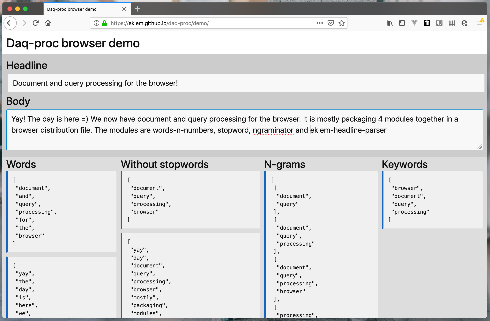

# daq-proc
Simple document and query processor for [nowsearch.xyz](https://github.com/eklem/nowsearch.xyz) to makes search running in the browser and node.js a little better. Removes stopwords (smaller index and less irrelevant hits), extract keywords to filter on and prepares ngrams for auto-complete functionality.

[![NPM version][npm-version-image]][npm-url]
[![NPM downloads][npm-downloads-image]][npm-url]
[![MIT License][license-image]][license-url]
[![Build Status][travis-image]][travis-url]

## Demo

Check out the [daq-proc interactive demo](https://eklem.github.io/daq-proc/demo/). It showcases the document processor end. Just add some words and figure it out. For the query side, the [hit-highlighter also has an interactive demo](https://eklem.github.io/hit-highlighter/demo/).

[](https://eklem.github.io/daq-proc/demo/)

This library is not creating anything new, but just packaging 6 libraries that goes well togehter into one browser distribution file. Also showing how it may be usefull through tests and the interactive demo.

## Libraries that daq-proc is depending on

* [`cheerio`](https://github.com/cheeriojs/cheerio) - Here specifically used to extract text from all- or parts of the HTML.
* [`eklem-headline-parser`](https://github.com/eklem/eklem-headline-parser) - Determines the most relevant keywords in a headline by considering article context
* [`hit-highlighter`](https://github.com/eklem/hit-highlighter) - Higlighting hits from a query in a result item.
* [`ngraminator`](https://github.com/fergiemcdowall/ngraminator) - Generate n-grams.
* [`stopword`](https://github.com/fergiemcdowall/stopword) - Removes stopwords from an array of words. To keep your index small and remove all words without a scent of information and/or remove stopwords from the query, making the search engine work less hard to find relevant results.
* [`words'n'numbers`](https://github.com/eklem/words-n-numbers) - Extract words and optionally numbers from a string of text into arrays. Arrays that can be fed to `stopword`, `eklem-headline-parser` and `ngraminator`.

## Browser

### Example - document processing side

```HTML
<script src="daq-proc.js"></script>

<script>
  // exposing the underlying libraries in a transparent way
  const {cheerio, ehp, highlight, ngraminator, sw, wnn} = dqp

  // input
  const headlineString = 'Document and query processing for the browser!'
  const bodyString = 'Yay! The day is here =) We now have document and query processing for the browser. It is mostly packaging 4 modules together in a browser distribution file. The modules are words-n-numbers, stopword, ngraminator and eklem-headline-parser'

  // extracting word arrays
  let headlineArray = wnn.extract(headlineString, {regex: wnn.wordsAndNumbers, toLowercase: true})
  let bodyArray = wnn.extract(bodyString, {regex: wnn.wordsAndNumbers, toLowercase: true})
  console.log('Word arrays: ')
  console.dir(headlineArray)
  console.dir(bodyArray)

  // removing stopwords
  let headlineStopped = sw.removeStopwords(headlineArray)
  let bodyStopped = sw.removeStopwords(bodyArray)
  console.log('Stopword removed arrays: ')
  console.dir(headlineStopped)
  console.dir(bodyStopped)

  // n-grams
  let headlineNgrams = ngraminator(headlineStopped, [2,3,4])
  let bodyNgrams = ngraminator(bodyStopped, [2,3,4])
  console.log('Ngram arrays: ')
  console.dir(headlineNgrams)
  console.dir(bodyNgrams)

  // calculating important keywords
  let keywords = ehp.findKeywords(headlineStopped, bodyStopped, 5)
  console.log('Keyword array: ')
  console.dir(keywords)
</script>
```

### Example - Query side

```HTML
<script src="daq-proc.js"></script>

<script>
  // exposing the underlying libraries in a transparent way
  const {cheerio, ehp, highlight, ngraminator, sw, wnn} = dqp

  const query = ['interesting', 'words']
  const searchResult = ['some', 'interesting', 'words', 'to', 'remember']

  highlight(query, searchResult)

  // returns:
  //[
  //  'some',
  //  '<span class="highlighted">interesting</span>',
  //  '<span class="highlighted">words</span>',
  //  'to',
  //  'remember'
  //]
</script>
```


## Node.js
It's fully possible to use on Node.js too. The tests are both for Node.js and the browser. But it's only wrapping 6 libraries for the ease of use in the browser, so I'm not sure why you would do that. [Holler if you disagree =)](https://github.com/eklem/daq-proc/issues/new).

[license-image]: http://img.shields.io/badge/license-MIT-blue.svg?style=flat
[license-url]: LICENSE
[npm-url]: https://npmjs.org/package/daq-proc
[npm-version-image]: http://img.shields.io/npm/v/daq-proc.svg?style=flat
[npm-downloads-image]: http://img.shields.io/npm/dm/daq-proc.svg?style=flat
[travis-url]: http://travis-ci.org/eklem/daq-proc
[travis-image]: http://img.shields.io/travis/eklem/daq-proc.svg?style=flat

